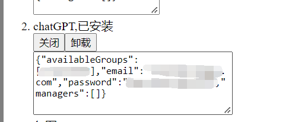
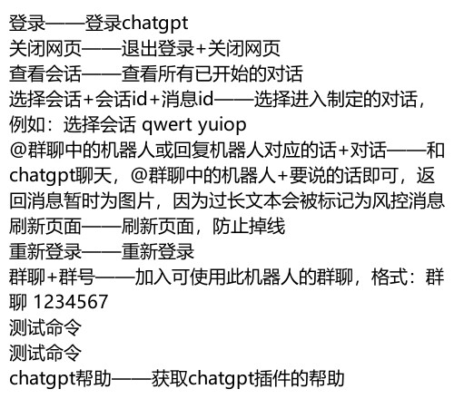

## chatGPT 插件支持

### 安装

依照机器人[readme](../../../README.md)载入插件，在管理页面中安装和启动

### 配置

- availableGroups 机器人可接收指令的群聊
- email chatgpt账号
- password chatgpt邮箱
- managers 插件管理员

### 使用

启动后使用指令 `chatgpt帮助`，可查看所有可用指令

### 特点

- 支持多个群聊同时使用
- 支持会话跟踪
- 记录会话和消息，回复指定qq消息相当于回复指定chatgpt的消息
- 定点刷新防掉线
- 消息自动处理为图片，防止风控
